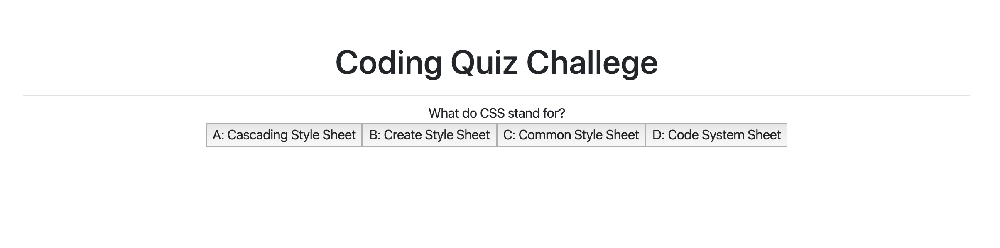

# Title 

JavasScript Code Quiz!

## Project Descritpion

This a quiz that will allow you to test your JavaSript knowledge by reviewing and
answering a few questions. After every question you answer you will be provided with a Correct/Wrong result as well as a grade in the end of the quiz. 

***The quiz is timed, and every time you answer wrong, 5 seconds will be subtracted from the remainign time***

<<<<<<< HEAD
### Built With

* HTLM (https://developer.mozilla.org/en-US/docs/Glossary/HTML#Concept_and_syntax)
* Jacascript (https://developer.mozilla.org/en-US/docs/Web/JavaScript)
=======

### Screenshots

### How to access the quiz
URL:  https://k3vindi3s3l.github.io/K3vinDi3s3l.HW4.io/

Please follow this URL and you will be directed to the quiz.
URL: https://k3vindi3s3l.github.io/K3vinDi3s3l.HW4.io/

### Built With

* HTLM (https://developer.mozilla.org/en-US/docs/Glossary/HTML#Concept_and_syntax)
* Jacascript (https://developer.mozilla.org/en-US/docs/Web/JavaScript)
>>>>>>> 29c378bae81aca1a7743cf271406cd173fd21ce5
